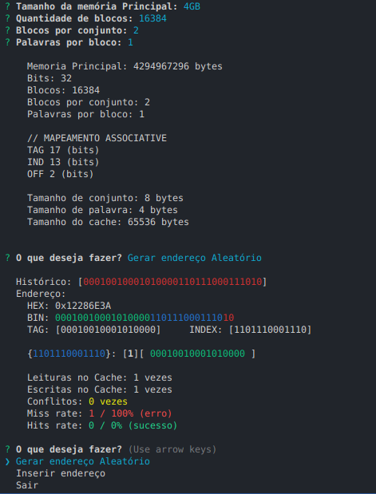

# CacheTSimulator


### Cache Simulator in Typescript




## Requeriments
- Nodejs Installed
- Npm or Yarn (packages manager) installed

# Usage
### Install Dependencies
```shell
$ npm install
$ yarn install
```

### Build
```shell
$ npm run build
$ yarn build
```

### Start (Run in Javascript)
```shell
$ npm run start
$ yarn build
```

### Or Run Project in Typescript (no Build)
```shell
$ npm run serve
$ yarn build
```
